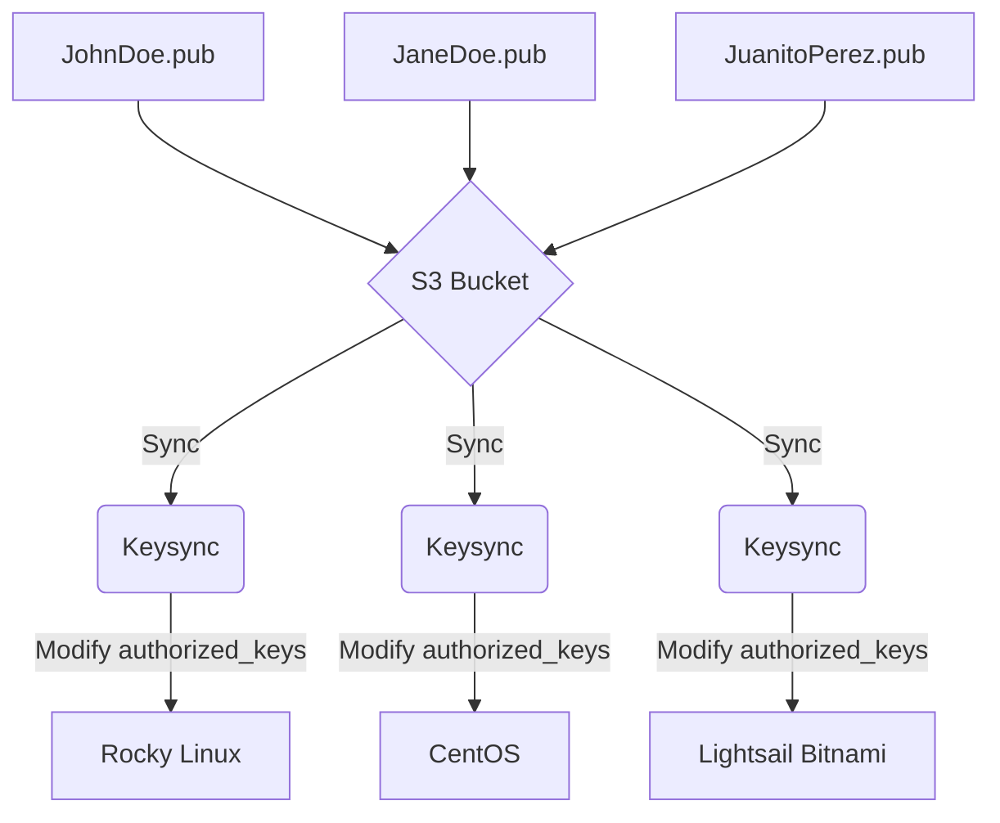

# Keysync
Keysync is a bash script to automatically synchronize SSH public keys in an S3 bucket and "authorized_keys" file. Useful when many users have to manage multiple remote instances, improving security by centralizing the public key management in an AWS S3 bucket and giving an option instead of sharing instances key pair.
## Installation
To Install the script you must follow these steps:
Verify you have AWS CLI installed with:

    aws --version
If not, then you can follow [this guide](https://docs.aws.amazon.com/cli/latest/userguide/getting-started-install.html) to install it.
When AWS CLI is ready to use, configure it:

    aws configure
It is important that the account you're using for AWS CLI has access to the bucket you want to store keys in. This script also uses [Cronie](https://github.com/cronie-crond/cronie/), so be sure it is installed as well.
Clone the repo to whatever directory you want (and own in your system!)

    git clone https://github.com/RazgrizXhunter/keysync.git

Configure and install:

    ./keysync.sh -C
    ./keysync.sh -I

if no prior configuration is done before installing, it'll propmt the config dialog. The script will ask for the frequency to set the cron job, be sure to use [cron's time format](https://crontab.guru/).
## How it works

Thanks to AWS CLI and Cronie, this script can sync files automatically with the bucket and make changes to the authorized_keys file based on the changes to the bucket, such as adding, deleting or modifying a key. If properly configured, changes should propagate to all instances running this script in their frequency update time.